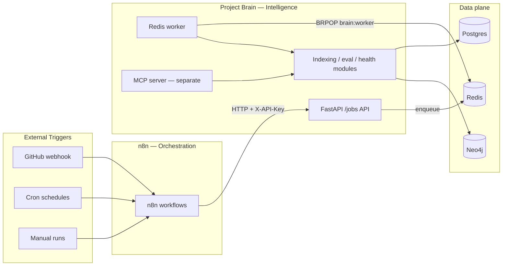

# Phase 9: n8n Operations Orchestration

n8n is the **external control plane** around Project Brain. It schedules workflows, reacts to Git events, and delivers notifications. It does **not** implement retrieval, indexing, embeddings, or MCP logic.

## Architecture



## What n8n does

| Responsibility | Example |
|---|---|
| Authenticated GitHub Actions push → incremental re-index | `git-merge-reindex.json` |
| Nightly exact dense + LFM corpus maintenance | `nightly-deep-maintenance.json` |
| Nightly health + stale embeddings job | `nightly-health.json` |
| Nightly evidence-bound insight scan | `nightly-proactive-insights.json` |
| Weekly smoke evaluation benchmark | `weekly-benchmark.json` |
| Future: PR impact, backups, ADR import, report publishing | Planned workflows |

## What n8n does NOT do

- Retrieval, RRF, graph traversal, context pack building
- Embedding generation or indexing core logic
- MCP proxy (MCP uses stdio; n8n MCP Trigger uses SSE — keep them separate)

## Components

| Component | Role |
|---|---|
| `brain-worker` | Consumes `brain:worker:*` Redis queue, runs jobs |
| `brain-api` | Thin `POST /jobs/*` endpoints, enqueues only |
| `brain-n8n` | Self-hosted n8n on port **5678**, SQLite volume, Redis db **2** for Bull |
| Redis db 0 | Project Brain worker queue (`WORKER_REDIS_PREFIX`) |

## Setup

1. Copy environment template:

   ```bash
   cp .env.example .env
   ```

2. Set `PROJECT_BRAIN_API_KEY` (shared by API and n8n).

3. Start stack:

   ```bash
   docker compose up -d --build
   ```

   Services: Postgres `5433`, Redis `6379`, Neo4j `7474/7687`, API `8000`, worker, n8n `5678`.

4. Open n8n: [http://localhost:5678](http://localhost:5678)  
   Login: `N8N_BASIC_AUTH_USER` / `N8N_BASIC_AUTH_PASSWORD` from `.env`.

## Workflow catalog (Project Brain only)

The repo ships **six** n8n workflows under `n8n/workflows/`. Legacy External Brain exports (Telegram, Gmail, Calendar, Notion, Daily Briefing, etc.) were removed — do not re-import them.

| File | Purpose |
|------|---------|
| `git-merge-reindex.json` | Authenticated master push webhook → durable reindex job |
| `n8n-error-self-diagnosis.json` | Error trigger → durable self-diagnosis job |
| `nightly-deep-maintenance.json` | Cron 00:30 UTC: reindex, dense repair, exact LFM sync/prune and relevance probes |
| `nightly-health.json` | Cron: nightly harness health job |
| `nightly-proactive-insights.json` | Cron: deterministic evidence scan into the dashboard inbox |
| `weekly-benchmark.json` | Cron: bounded smoke benchmark job |

The dashboard **Orchestration** page lists only these workflows (from the n8n API when reachable, otherwise from repo JSON). Workflows with zero nodes are hidden.

5. Run `deploy/server_up.sh`. After both API and n8n are healthy it imports and publishes exactly the six files above.

## Reset n8n when old workflows persist

Imported workflows live in the Docker volume `n8n_data` (SQLite under `/home/node/.n8n`), not in git. If the n8n UI or dashboard still shows legacy External Brain workflows after cleanup:

**Option A — full reset (recommended for local dev)**

```bash
docker compose stop n8n
docker compose rm -f n8n
docker volume rm project-brain_n8n_data   # prefix may vary; run `docker volume ls | grep n8n`
docker compose up -d n8n
```

Then re-run `deploy/server_up.sh` to import and publish the six JSON files from `n8n/workflows/`.

**Option B — script**

```powershell
# Windows
.\scripts\reset_n8n_data.ps1
```

```bash
# Linux/macOS
./scripts/reset_n8n_data.sh
```

**Option C — delete workflows in n8n UI**

Open n8n → Workflows only for diagnosis; production import, deprecation cleanup, publication, and verification belong to `scripts/import_n8n_workflows.py`.

Optional: set `N8N_API_KEY` in `.env` so the dashboard reads live workflow state from the n8n REST API (filtered to Project Brain workflows only).

## Quick start (completed setup)

After `cp .env.example .env` and setting secrets (`PROJECT_BRAIN_API_KEY`, `N8N_*`):

```powershell
cd project-brain
docker compose up -d --build
.\scripts\import_n8n_workflows.ps1   # creates owner, imports and publishes 6 workflows
```

Note: n8n 2.x requires published workflow versions. The import script publishes all six canonical workflows and fails if any remains inactive.

Verify:

```powershell
docker compose ps
curl -X POST http://localhost:8000/jobs/reindex -H "X-API-Key: $env:PROJECT_BRAIN_API_KEY" -H "Content-Type: application/json" -d "{\"clean\": false}"
curl -X POST http://localhost:5678/webhook/git-merge -H "Content-Type: application/json" -d "{\"ref\": \"refs/heads/master\"}"
```

- **n8n UI:** http://localhost:5678 (`N8N_BASIC_AUTH_USER` / `N8N_BASIC_AUTH_PASSWORD`)
- **Dashboard:** http://localhost:8000/dashboard/orchestration

`scripts/import_n8n_workflows.ps1` imports all six repo workflows via the n8n REST API and activates them. HTTP nodes use `http://api:8000` and `PROJECT_BRAIN_API_KEY` from the n8n container environment. GitHub Actions sends `X-Project-Brain-Token` from the repository secret `PROJECT_BRAIN_WEBHOOK_TOKEN`; n8n validates it before enqueueing reindex work.

Production sets `PROACTIVE_INSIGHTS_ENABLED=true` and keeps `PROACTIVE_INSIGHTS_LLM_ENABLED=false`: the nightly scan is deterministic and does not spend provider tokens. Job completion and failures remain durable in the Project Brain job ledger and dashboard.

The production n8n service explicitly sets `N8N_BLOCK_ENV_ACCESS_IN_NODE=false` because canonical expressions read `PROJECT_BRAIN_API_KEY` and `PROJECT_BRAIN_WEBHOOK_TOKEN` from the container environment. This is paired with a separately authenticated editor and a Git-only workflow publication policy; do not import untrusted workflows into this instance.

## Job API (for n8n HTTP Request nodes)

All endpoints require header `X-API-Key: <PROJECT_BRAIN_API_KEY>` when the key is set.

| Method | Path | Description |
|--------|------|-------------|
| `POST` | `/jobs/reindex` | Incremental index (`{"repo_path": "...", "clean": false}`) |
| `POST` | `/jobs/health-check` | DB health + embedding inventory |
| `POST` | `/jobs/embedding-verify` | Verify embeddings + pgvector coverage |
| `POST` | `/jobs/benchmark` | Golden tasks eval (`{"smoke": true}` for quick run) |
| `POST` | `/jobs/nightly-maintenance` | Quality-first reindex, dense repair, exact LFM sync/prune and local relevance probes |
| `POST` | `/jobs/deep-context` | Queue an exact LFM-reranked context pack without changing ordinary traffic |
| `GET` | `/jobs/{job_id}` | Poll job status (`queued` → `running` → `completed` / `failed`) |

Response on enqueue:

```json
{
  "job_id": "uuid",
  "status": "queued",
  "status_url": "/jobs/uuid"
}
```

## First workflow walkthrough: Git merge → reindex

**Workflow file:** `n8n/workflows/git-merge-reindex.json`

**Webhook URL (after import & activation):**

```
http://localhost:5678/webhook/git-merge
```

Or from another container on the compose network:

```
http://n8n:5678/webhook/git-merge
```

**Pipeline steps:**

1. Webhook receives Git merge payload (configure GitHub/GitLab to POST here).
2. `POST /jobs/reindex` — incremental index (includes Neo4j graph refresh).
3. Poll `GET /jobs/{job_id}` after wait.
4. `POST /jobs/embedding-verify` — check stale/missing embeddings.
5. Poll status.
6. `POST /jobs/benchmark` with `smoke: true` — single golden task.
7. Poll status → build notification summary.

**Test manually:**

```bash
curl -X POST http://localhost:5678/webhook/git-merge \
  -H "Content-Type: application/json" \
  -d '{"ref": "refs/heads/master"}'
```

Ensure `brain-worker` is running (`docker compose ps worker`).

## MCP stays separate

AI agents connect via `python -m apps.mcp_server.server` (stdio). Do not route MCP through n8n. n8n orchestrates **operations**; MCP serves **interactive agent tools**.

## Local development without Docker

```bash
# Terminal 1 — API
uvicorn apps.api.main:app --reload --port 8000

# Terminal 2 — worker
python -m brain.workers.worker

# Terminal 3 — n8n (optional)
docker run -p 5678:5678 -v n8n_data:/home/node/.n8n n8nio/n8n
```

Set `PROJECT_BRAIN_API_URL=http://host.docker.internal:8000` if n8n runs in Docker but API on host.
